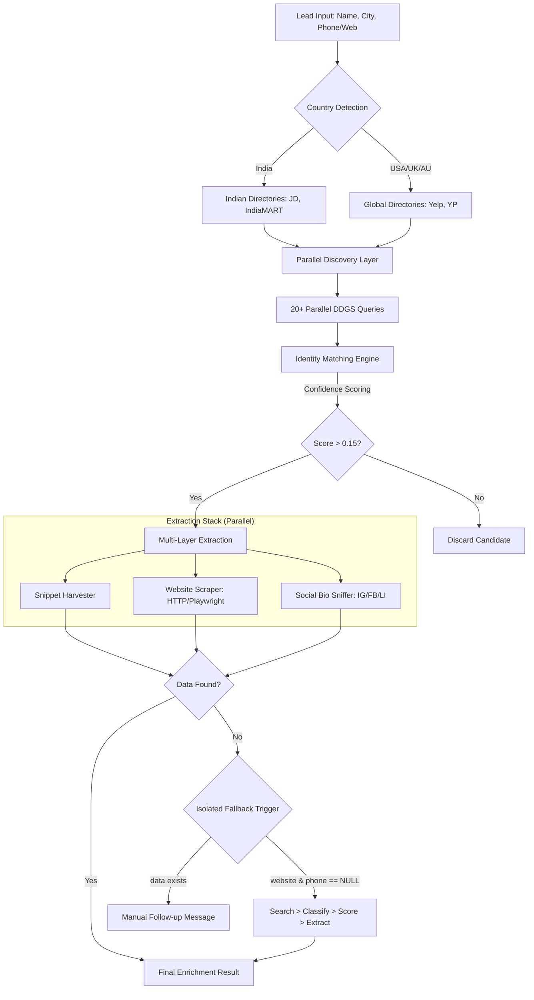

# LeadGenX: Global Business Identity & Enrichment Engine

LeadGenX is a high-performance, modular system designed to find missing contact information (emails & social profiles) for businesses globally. It operates on a **Discovery-Verification-Extraction** pipeline that executes in parallel for maximum speed.

## 🏗️ System Architecture & Full Flow



The system follows a strict 10-step sequence to ensure accuracy while maintaining a sub-10 second execution time:

### 1. The Entry Point (`resolver.py`)
Leads enter with varying degrees of completeness (Name, City, Phone, and/or Website).

### 2. Country Detection & Routing
The `country_detector` parses the location and phone prefix to route the lead to country-specific directories (e.g., IndiaMART for India, Yelp for USA/UK, Yellow Pages for Australia).

### 3. Parallel Search Layer
The engine generates 20+ specialized search queries (Social dorks, Email hunts, Directory lookups) and executes them in parallel threads using `ddgs`.

### 4. Entity Matching & Scoring (The Judge)
Raw search results are passed to the `entity_matcher`. Every URL is scored based on:
- **Phone Match (40%)**: Strongest link.
- **Name/Slug Similarity (25%)**: RapidFuzz name verification.
- **Snippet Context**: Keyword & City matching.

### 5. Snapshot Email Extraction (Layer 0)
The engine first scans search "snippets" (search result text) for emails. This is **instant and zero-cost**.

### 6. Website Enrichment (Layer 1)
If a website is found, the `website_extractor` tries a fast HTTP scrape followed by a **Playwright Stealth** fallback for JS-heavy sites.

### 7. Social Bio Sniffing (Layer 2)
The specialized `social_extractor` visits the best Instagram, Facebook, and LinkedIn profiles discovered during search to "sniff" for emails hidden in bios.

### 8. Fallback Isolation Gate
If a lead has **Zero Website** and **Zero Phone**, the system triggers the strictly isolated `fallback_identity_resolver` to attempt a deep-web rescue without affecting the main pipeline.

### 9. SMTP/MX Verification
Discovered or guessed emails are checked for valid MX records before being finalized.

### 10. Summary & Confidence Assignment
Results are aggregated, per-source confidence scores are computed, and a **Best Contact Method** is recommended (Email > Social > Phone > Manual).

---

## 📂 Project Mapping
- **/search**: Core query generation and global routing rules.
- **/match**: The Identity Resolution scoring logic.
- **/extractors**: Multi-mode scrapers (HTTP + Playwright).
- **/pipelines**: Main orchestration layer.
- **/fallback_identity_resolver**: The isolated "Missing Lead" rescue system.
- **/cache**: High-performance session storage.

## ⚙️ Tech Stack
- **Runtime**: Python 3.11+
- **Search**: `ddgs` (DuckDuckGo Search)
- **Scraping**: `Playwright` (Stealth), `BeautifulSoup4`, `httpx`
- **Logic**: `RapidFuzz` (String similarity), `dnspython` (MX validation)
- **CLI**: `Rich` (Terminal UI)

## 🛠️ How to Run
```bash
uv run python main.py
```
---
